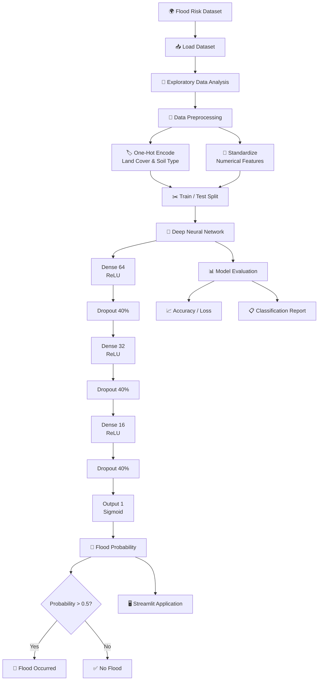

# 🌊 Flood Risk Predictor

### 🧠 Deep Learning–Based Flood Occurrence Prediction for India

<p align="center">
  
  
  
  
  
</p>

<p align="center">
  <b>🌧️ Turning environmental and geographical data into flood-risk predictions using Deep Learning.</b>
</p>

---

## 📌 Overview

**Flood Risk Predictor** is a Deep Learning–based binary classification project designed to predict whether a flood event is likely to occur based on a combination of **geographical, meteorological, hydrological, environmental, demographic, and historical flood indicators**.

The project uses a feed-forward Artificial Neural Network built with **TensorFlow/Keras** and provides a pathway toward interactive deployment through **Streamlit**.

> 🎯 **Prediction Target:** `Flood Occurred` → `0` or `1`

The underlying dataset contains **10,000 records and 14 original columns**.

---

## 🚀 Project Highlights

| 🔹 Component         | Details                           |
| -------------------- | --------------------------------- |
| 🎯 Task              | Binary Flood Classification       |
| 🧠 Model             | Artificial Neural Network         |
| ⚡ Framework          | TensorFlow / Keras                |
| 📊 Dataset Size      | 10,000 records                    |
| 🔢 Original Features | 13 input-related columns + target |
| 🧹 Encoding          | One-Hot Encoding                  |
| 📏 Scaling           | StandardScaler                    |
| 🏗️ Architecture     | 64 → 32 → 16 → 1                  |
| 🛡️ Regularization   | Dropout                           |
| ⏹️ Training Control  | Early Stopping                    |
| 📱 Deployment        | Streamlit                         |
| 🌐 Tunneling         | pyngrok                           |

---

# 🧭 System Workflow



---

# 🧠 Model Architecture

The model uses a sequential neural network consisting of **three hidden Dense layers**, each followed by **40% Dropout**, and a sigmoid output layer for binary classification.

```text
                    INPUT
                      │
                      ▼
              ┌──────────────┐
              │ Dense Layer  │
              │   64 Neurons │
              │     ReLU     │
              └──────┬───────┘
                     │
                     ▼
              ┌──────────────┐
              │ Dropout 40%  │
              └──────┬───────┘
                     │
                     ▼
              ┌──────────────┐
              │ Dense Layer  │
              │   32 Neurons │
              │     ReLU     │
              └──────┬───────┘
                     │
                     ▼
              ┌──────────────┐
              │ Dropout 40%  │
              └──────┬───────┘
                     │
                     ▼
              ┌──────────────┐
              │ Dense Layer  │
              │   16 Neurons │
              │     ReLU     │
              └──────┬───────┘
                     │
                     ▼
              ┌──────────────┐
              │ Dropout 40%  │
              └──────┬───────┘
                     │
                     ▼
              ┌──────────────┐
              │ Output Layer │
              │  1 Neuron    │
              │   Sigmoid    │
              └──────┬───────┘
                     │
                     ▼
               🌊 FLOOD / NO FLOOD
```

### ⚙️ Network Configuration

| Layer       | Configuration            | Parameters |
| ----------- | ------------------------ | ---------: |
| Input/Dense | 64 neurons + ReLU        |      1,280 |
| Dropout     | 40%                      |          0 |
| Dense       | 32 neurons + ReLU        |      2,080 |
| Dropout     | 40%                      |          0 |
| Dense       | 16 neurons + ReLU        |        528 |
| Dropout     | 40%                      |          0 |
| Output      | 1 neuron + Sigmoid       |         17 |
| **Total**   | **Trainable Parameters** |  **3,905** |

The notebook reports **3,905 trainable parameters**.

---

# 🌍 Dataset

The project uses the **Flood Risk in India** dataset downloaded through KaggleHub.

```python
kagglehub.dataset_download(
    "s3programmer/flood-risk-in-india"
)
```

The dataset contains **10,000 observations** and initially has **14 columns**.

### 📊 Features

| Feature                   | Category       |
| ------------------------- | -------------- |
| 📍 Latitude               | Geographic     |
| 📍 Longitude              | Geographic     |
| 🌧️ Rainfall (mm)         | Meteorological |
| 🌡️ Temperature (°C)      | Meteorological |
| 💧 Humidity (%)           | Meteorological |
| 🌊 River Discharge (m³/s) | Hydrological   |
| 📈 Water Level (m)        | Hydrological   |
| ⛰️ Elevation (m)          | Geographic     |
| 🌳 Land Cover             | Environmental  |
| 🪨 Soil Type              | Environmental  |
| 👥 Population Density     | Demographic    |
| 🏗️ Infrastructure        | Infrastructure |
| 📜 Historical Floods      | Historical     |
| 🎯 Flood Occurred         | **Target**     |

The dataset contains categorical variables for **Land Cover** and **Soil Type**, which are transformed using one-hot encoding.

---

# 🔬 Data Preprocessing Pipeline


### 1️⃣ One-Hot Encoding

Categorical columns:

* `Land Cover`
* `Soil Type`

are converted into numerical representations using:

```python
pd.get_dummies(
    df,
    columns=["Land Cover", "Soil Type"],
    drop_first=True
)
```

### 2️⃣ Train/Test Split

The processed dataset is divided into:

```text
🟢 Training Set : 8,000 samples
🔵 Testing Set  : 2,000 samples
```

The notebook reports **19 model input features after preprocessing**.

### 3️⃣ Feature Scaling

Numerical features are standardized using:

```python
StandardScaler()
```

The scaler is fitted on the training data and then applied to the test data.

---

# 🏋️ Model Training

The model is compiled using:

```python
optimizer = "Adam"
loss = "binary_crossentropy"
metric = "accuracy"
```

Training configuration:

```text
Epochs       → 100 maximum
Batch Size   → 32
Validation   → 20%
Early Stop   → patience = 10
```

Early stopping restores the best-performing weights based on validation loss.

---

# 📈 Model Performance

The current notebook evaluation reports:

| Metric               |     Result |
| -------------------- | ---------: |
| 🎯 Test Loss         | **0.7259** |
| ✅ Test Accuracy      | **50.15%** |
| 🎯 Class 0 Precision |       0.50 |
| 🎯 Class 0 Recall    |       0.65 |
| 🎯 Class 0 F1        |       0.56 |
| 🌊 Class 1 Precision |       0.51 |
| 🌊 Class 1 Recall    |       0.35 |
| 🌊 Class 1 F1        |       0.42 |
| 📊 Macro F1          |       0.49 |

These values are taken directly from the notebook's test evaluation and classification report.

### ⚠️ Current Status

The present model should be considered a **baseline/prototype rather than a production-ready flood-warning system**.

The approximately **50% test accuracy** indicates that the current architecture and/or dataset relationship needs further improvement before it can support reliable real-world flood-risk decisions.

That's actually useful from a research perspective: the project establishes a complete **data → preprocessing → deep learning → evaluation → deployment pipeline** that can now be iterated on.

---

# 🖥️ Streamlit Deployment

The project also explores deployment using **Streamlit**.


## The notebook installs Streamlit and launches an `app.py` application, with `pyngrok` used to expose the local application through a public tunnel during experimentation.

# 🛠️ Tech Stack

```text
🐍 Python
│
├── 📊 Pandas
├── 🔢 NumPy
├── 📈 Matplotlib
├── 🎨 Seaborn
│
├── 🤖 TensorFlow
│   └── Keras
│
├── 🧪 Scikit-learn
│   ├── StandardScaler
│   └── Classification Metrics
│
└── 🖥️ Streamlit
    └── pyngrok
```

---

# 📁 Recommended Project Structure

```text
Flood-Risk-Predictor/
│
├── 📓 Flood_Risk_Predictor.ipynb
├── 🐍 app.py
├── 📄 requirements.txt
├── 🧠 model/
│   └── flood_risk_model.keras
│
├── 📊 data/
│   └── flood_risk_dataset_india.csv
│
├── 🖼️ assets/
│   ├── architecture.png
│   ├── training-history.png
│   └── app-preview.png
│
└── 📖 README.md
```

---

# ⚡ Installation

### 1. Clone the repository

```bash
git clone https://github.com/YOUR_USERNAME/Flood-Risk-Predictor.git
cd Flood-Risk-Predictor
```

### 2. Create a virtual environment

```bash
python -m venv venv
```

### 3. Activate it

**Windows:**

```bash
venv\Scripts\activate
```

**Linux / macOS:**

```bash
source venv/bin/activate
```

### 4. Install dependencies

```bash
pip install -r requirements.txt
```

---

# ▶️ Run the Notebook

Open:

```text
Flood_Risk_Predictor.ipynb
```

You can run it using:

* Google Colab ☁️
* Jupyter Notebook 📓
* VS Code 💻

---

# 🖥️ Run the Streamlit Application

If `app.py` is included in the repository:

```bash
streamlit run app.py
```

Then open the local Streamlit URL shown in the terminal.

---

# 🔮 Future Improvements

The current baseline creates a strong foundation, but several improvements could significantly increase model quality:

### 🧠 Model Improvements

* [ ] Hyperparameter optimization
* [ ] Experiment with deeper/wider architectures
* [ ] Compare ANN against Random Forest, XGBoost and other baselines
* [ ] Tune dropout rates
* [ ] Tune classification threshold
* [ ] Perform cross-validation

### 📊 Data Improvements

* [ ] Add time-series rainfall data
* [ ] Add real-time river-level measurements
* [ ] Add satellite-derived environmental features
* [ ] Incorporate historical weather patterns
* [ ] Add regional/geospatial flood information
* [ ] Validate against real flood-event datasets

### 🚨 Early-Warning System

* [ ] Real-time data ingestion
* [ ] Risk-level classification
* [ ] Automated alerts
* [ ] Interactive flood-risk map
* [ ] Location-based predictions
* [ ] Historical trend visualization

### ☁️ Deployment

* [ ] Save trained model
* [ ] Save preprocessing pipeline
* [ ] Deploy Streamlit application
* [ ] Containerize with Docker
* [ ] Deploy to cloud infrastructure
* [ ] Add API endpoint

---

# 💡 Why This Project Matters

Flood prediction is not simply a machine-learning problem.

It sits at the intersection of:

```text
🌧️ Climate
     +
🌊 Hydrology
     +
🗺️ Geography
     +
🏙️ Infrastructure
     +
👥 Population
     +
🤖 Artificial Intelligence
     =
🚨 Disaster Risk Management
```

A reliable system could eventually support **early-warning workflows, infrastructure planning, emergency preparedness, and risk-aware decision making**.

---

# ⚠️ Disclaimer

This project is an **educational/research prototype**.

The current model achieves approximately **50.15% test accuracy** and should **not be used as a standalone system for real-world emergency decisions**. Further validation, better data, model improvement, calibration, and domain-specific testing are required before operational deployment.

---

# 👨‍💻 Project Status

```text
🟢 Dataset              → Completed
🟢 EDA                  → Completed
🟢 Preprocessing        → Completed
🟢 Neural Network       → Completed
🟢 Model Training       → Completed
🟢 Evaluation           → Completed
🟡 Model Optimization   → In Progress
🟡 Production Deployment→ Future Work
🔴 Real-Time Prediction → Future Work
```

---

# ⭐ Key Takeaway

> **The goal isn't just to train a neural network.**
>
> **The goal is to build a complete pipeline that can evolve from an experimental ML model into a reliable disaster-risk intelligence system.** 🌊🧠🚨

---

## 🤝 Contributing

Contributions, experiments, model improvements, and ideas are welcome.

```text
Fork → Experiment → Improve → Pull Request 🚀
```

---

## 📜 License

This project is intended for educational and research purposes.

---

<p align="center">
  🌊 <b>Flood Risk Predictor</b> 🌊
  <br>
  <i>Deep Learning for Smarter Flood Risk Analysis</i>
  <br><br>
  ⭐ Star the repository if you found it useful!
</p>
